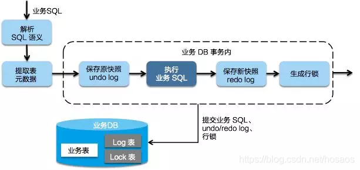
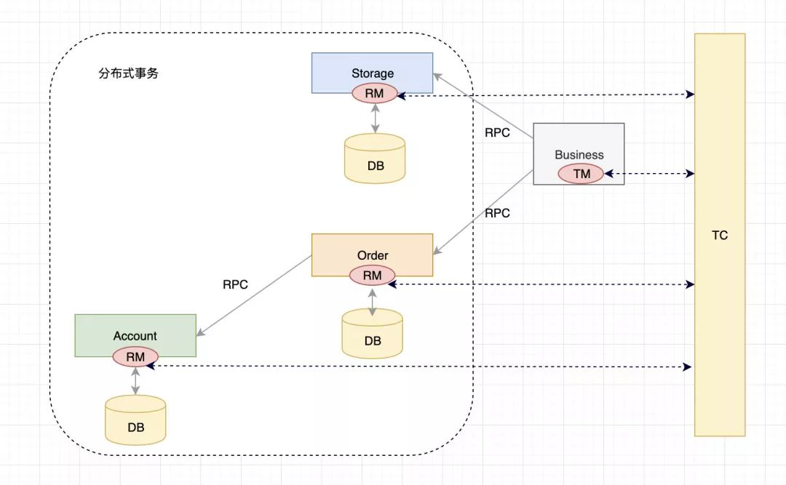

# Seata


# 概述


* 阿里的分布式事务框架,支持AT,XA,TCC等,详见官网
* Seata主要由三个重要组件组成
  * TC:Transaction Coordinator,事务协调器,管理全局的分支事务的状态,用于全局事务的提交和回滚
  * TM:Transaction Manager,事务管理器,用于开启,提交或者回滚全局事务
  * RM:Resource Manager,资源管理器,用于分支事务上的资源管理,向TC注册分支事务,上报分支事务的状态,接受TC的命令来提交或者回滚分支事务


# 安装


* 安装事务协调器:seate-server

 * 下载解压并修改相关配置文件

 * registry.conf:注册中心配置

   ```json
   # 接入注册中心
   registry {
   	type = "nacos"
       # 负载均衡采用随机策略
       loadBalance = "RandomLoadBalance"
   	loadBalanceVirtualNodes = 10
       nacos {
           serverAddr = "localhost:8848"
       	# 分配应用组,命令空间
   		group="SEATA_GROUP"
           namespace = "public"
       	# 集群名称,采用默认值default即可
           cluster = "default"
       	# nacos接口用户名密码
   		username = "nacos"
       	password = "nacos"
       }
   }
   
   # 接入配置中心
   config {
       type = "nacos"
       nacos {
           serverAddr = "localhost:8848"
       	group="SEATA_GROUP"
           namespace = "public"
           cluster = "default"
       	username = "nacos"
       	password = "nacos"
       }
   }
   ```

 * 在 Nacos 配置中心中初始化 Seata 配置,由Seata官网提供,可访问相关[地址](https://github.com/seata/seata/blob/1.4.0/script/config-center/config.txt)中的config.txt进行查看

 * 将config.txt复制到seata-server根目录下,同时修改`store.mode=file->store.mode=db`,修改以`store.db`开头的全局事务数据库地址为项目需要使用的数据库地址

 * 下载[nacos-config.sh](https://github.com/seata/seata/blob/1.4.0/script/config-center/nacos/nacos-config.sh),存储到seata根目录下的script下,没有script就新建,运行nacos-config.sh

   ```shell
   # ip是nacos注册中心的ip
   sh nacos-config.sh -h 192.168.1.150
   ```
   
 * [建表](https://github.com/seata/seata/blob/develop/script/server/db/mysql.sql):

   * global_table:保存全局事务数据
   * branch_table:保存分支事务数据
   * 
      lock_table:保存锁定资源数据

 * 启动:`seata-server.sh -h 127.0.0.1 -p 8091 -m db -n 1 -e test`

   * -h:注册到注册中心的ip
   * -p:Server rpc 监听端口
   * -m:全局事务会话信息存储模式,file,db,redis,优先读取启动参数
   * -n:Server node,多个Server时,需区分各自节点,用于生成不同区间的transactionId,以免冲突
   * -e:多环境配置参考 http://seata.io/en-us/docs/ops/multi-configuration-isolation.html

 * 每一个使用了Seata的数据库中都需要创建undo.log表,根据[官网](https://github.com/seata/seata/blob/1.4.0/script/client/at/db/mysql.sql)创建

 * 微服务Client导入依赖

   ```xml
   <dependency>
       <groupId>com.alibaba.cloud</groupId>
       <artifactId>spring-cloud-starter-alibaba-nacos-discovery</artifactId>
   </dependency>
   <dependency>
       <groupId>io.seata</groupId>
       <artifactId>seata-spring-boot-starter</artifactId>
       <version>最新版</version>
   </dependency>
   <dependency>
       <groupId>com.alibaba.cloud</groupId>
       <artifactId>spring-cloud-starter-alibaba-seata</artifactId>
       <version>2.2.1.RELEASE</version>
       <exclusions>
           <exclusion>
               <groupId>io.seata</groupId>
               <artifactId>seata-spring-boot-starter</artifactId>
           </exclusion>
       </exclusions>
   </dependency>
   ```

 * 所有用到分布式事务的微服务使用seata的DataSourceProxyConfig代理自己的数据源

   ```java
   @Configuration
   public class DataSourceProxyConfig {
       @Bean
       @ConfigurationProperties(prefix = "spring.datasource")
       public DruidDataSource druidDataSource() {
           return new DruidDataSource();
       }
   
       @Primary
       @Bean
       public DataSourceProxy dataSource(DruidDataSource druidDataSource) {
           return new DataSourceProxy(druidDataSource);
       }
   }
   ```

 * 每个微服务的bootstrap.yml都需要配置seata全局事务组

   ```yaml
   spring:
   	application:
   		name: service-product
   	datasource:
       	driver-class-name: com.mysql.cj.jdbc.Driver
       	url: jdbc:mysql://192.168.1.150:3306/seata-order
       	username: root
       	password: root
   	cloud:
   		nacos:
   			discovery:
           		username: nacos
           		password: nacos
           		server-addr: 192.168.1.150:8848
   			config:
   				server-addr: localhost:8848 # nacos的服务端地址
   				namespace: public
   				group: SEATA_GROUP
           alibaba:
               seata:
                   tx-service-group: ${spring.application.name}
   # seata配置
   seata:
   	# 开启seata分布式事务
     	enabled: true
   	# 事务服务分组名,与naocs一致
     	tx-service-group: my_test_tx_group
   	# 是否启用数据源代理
     	enable-auto-data-source-proxy: true
   	# 事务服务配置
     	service:
       	vgroup-mapping:
   		# 事务分组对应集群名称
         	my_test_tx_group: default
       	grouplist:
   		# Seata-Server服务的IP地址与端口
         		default: 192.168.1.150:8091
       	enable-degrade: false
       	disable-global-transaction: false
   	# Nacos配置中心信息
   	config:
       	type: nacos
       	nacos:
             	namespace: public
             	serverAddr: 192.168.1.150:8848
             	group: SEATA_GROUP
             	username: nacos
             	password: nacos
             	cluster: default
   	# Nacos注册中心信息
     	registry:
       	type: nacos
           nacos:
    			application: seata-server
    			server-addr: 192.168.1.150:8848
    			group : SEATA_GROUP
    			namespace: public
    			username: nacos
    			password: nacos
    			cluster: default
   
   logging:
     	level:
       	io:
         		seata: debug
   ```

 * 在微服务中开启全局事务:`@GlobalTransactional`,分支事务仍使用`@Transactional`

 * 每个微服务都必须导入registry.conf,file.conf,vgroup_mapping.{application.name}-fescar-server-group="default"


# 事务流程


* TM向TC申请开启一个全局事务,TC创建全局事务后返回全局唯一XID,XID会在全局事务上下文传播
* RM向TC注册分支事务,该分支事务归属于拥有相同XID的全局事务
* 各个RM执行相应的分支事务
* TM向TC发起全局提交或回滚
* TC调度XID下的分支事务完成提交或回滚


# AT


## 概述


 * AT模式是基于XA事务演进而来的一个分布式事务中间件,XA是一个基于数据库实现的分布式事务协议,本质上和两阶段提交一样,需要数据库支持,Mysql5.6以上版本支持XA协议
 * 一种无侵入的分布式事务解决方案,2PC的广义实现
 * 编程模型不变,轻依赖不需要为分布式事务场景做特定设计
 * 一阶段提交,不阻塞,连接释放,保证整个系统的吞吐
 * Transaction Coordinator(TC):事务协调器,它是独立的中间件,需要独立部署运行,它维护全局事务的运行状态,接收TM指令发起全局事务的提交与回滚,负责与RM通信协调各各分支事务的提交或回滚
 * Transaction Manager(TM):事务管理器,TM需要嵌入应用程序中工作,负责开启一个全局事务,并最终向TC发起全局提交或全局回滚的指令
 * Resource Manager(RM):控制分支事务,负责分支注册,状态汇报,并接收事务协调器的指令,驱动分支(本地)事务的提交和回滚
 * Seata有一个重要的机制:**回滚日志**
    * 每个分支事务对应的数据库中都需要有一个回滚日志表 UNDO_LOG,在真正修改数据库记录之前,都会先记录修改前的记录值,以便之后回滚
    * 在收到回滚请求后,会根据 UNDO_LOG 生成回滚操作的 SQL 语句来执行
    * 如果收到的是提交请求,就把 UNDO_LOG 中的相应记录删除掉
 * RM是通过**监控拦截JDBC**实现自动和 TC 交互的.例如监控到开启本地事务了,就会自动向TC注册、生成回滚日志、向TC汇报执行结果
 * 如果二阶段回滚失败,例如有某个微服务挂掉了,那么所有正常的微服务也都不会执行回滚,当这个微服务重新正常运行后,TC 会重新执行全局回滚


## 事务流程


* 每个RM使用DataSourceProxy连接数据库,其目的是使用ConnectionProxy,使用数据源和数据连接代理的目的就是在第一阶段将undo_log日志和业务数据放在一个本地事务提交,这样就保证了只要有业务操作就一定有undo_log
* 在第一阶段undo_log中存放了数据修改前和修改后的值,为事务回滚作好准备,所以第一阶段完成就已经将分支事务提交,也就释放了锁资源
* TM开启全局事务开始,将XID全局事务id放在事务上下文中,通过feign调用也将XID传入下游分支事务,每个分支事务将自己的Branch ID分支事务ID与XID关联
* 第二阶段全局事务提交,TC会通知各各分支参与者提交分支事务,在第一阶段就已经提交了分支事务,这里各各参与者只需要删除undo_log即可,并且可以异步执行,第二阶段很快可以完成
* 第二阶段全局事务回滚,TC会通知各各分支参与者回滚分支事务,通过 XID 和 Branch ID 找到相应的回滚日志,通过回滚日志生成反向的 SQL 并执行,以完成分支事务回滚到之前的状态,如果回滚失败则会重试回滚操作


## 第一阶段


* Seata的JDBC数据源代理通过对业务SQL的解析,把业务数据在更新前后的数据镜像组织成回滚日志,利用本地事务的ACID 特性,将业务数据的更新和回滚日志写入在同一个本地事务中提交.这样可以保证任何提交的业务数据的更新一定有相应的回滚日志存在
* 提交完成之后将生成后镜像,即更新后的数据保存为快照,用于事务的幂等,隔离等



* 基于这样的机制,分支的本地事务便可以在全局事务的第一阶段提交,并马上释放本地事务锁定的资源,并且不占用数据库连接
* 这也是Seata和XA事务的不同之处,两阶段提交往往对资源的锁定需要持续到第二阶段实际的提交或者回滚,而有了回滚日志之后,可以在第一阶段释放对资源的锁定,降低了锁范围,提高效率,即使第二阶段发生异常需要回滚,只需找对undo.log中对应数据并反解析成sql来达到回滚目的
* 同时Seata通过代理数据源将业务sql的执行解析成undo.log来与业务数据的更新同时入库,达到了对业务无侵入的效果


## 第二阶段


* 如果决议是全局提交,此时分支事务在第一阶段已经完成提交,不需要特殊处理,只需要异步清理回滚日志即可,二阶段可以非常快速地完成


* 如果决议是全局回滚,RM收到协调器发来的回滚请求,通过XID和Branch ID找到相应的回滚日志记录,**通过回滚记录生成反向的更新SQL并执行**,以完成分支的回滚


## 提交成功


## 回滚


* 因为一阶段已经提交数据,如果二阶段发生异常需要回滚,此时可能发生事务问题
* 先需要用一阶段生成的新镜像和回滚时数据库的数据进行比对,如果数据一致,则进行回滚.如果数据不一致,需要根据实际情况进行更新操作


## 应用


* 一个商城购买商品的接口,需要同时调用3个微服务

* 第一步,在商城应用(TM)与三个服务(RM)启动后自动向事务协调者Seata-Server(TC)进行注册,让 TC 知晓各个组件的详细信息

* 第二步,当会员购物时会执行 TM 的会员采购方法,当进入方法前 Seata 为 TM 提供的客户端会自动生效,向 TC 发出开启全局事务的请求

* 第三步,会员采购方法开始执行,会依次执行 3 个服务的新增订单,增加积分,减少库存,在请求送往新的 RM 时,都会向 TC 注册新的分支事务.这些分支事务在处理时不但向业务表写入数据,还会自动向 Seata 强制要求的 UNDO_LOG 回滚日志表写入回滚 SQL 日志

* 以新增订单事务为例:新增订单时执行的 SQL 语句如下

  ```sql
  INSERT INTO order(id,...) values(1001,...);
  ```

* 与之对应的,Seata 的回滚日志是基于 SQL 反向生成,新增订单创建了 1001 订单,那 Seata会对 SQL 进行解析生成反向的回滚 SQL 日志保存在 UNDO_LOG 表,如下所示

  ```sql
  DELETE FROM order WHERE id = 1001;
  ```

* 与之类似会员积分会生成加积分的业务 SQL 以及减积分的回滚 SQL

  ```sql
  -- 加积分
  UPDATE FROM points SET point = 180 + 20 WHERE mid = 182;
  -- UNDO_LOG表中的减积分SQL
  UPDATE FROM points SET point = 200 - 20 WHERE mid = 182;
  ```

* 第四步,当 RM 的分支事务执行成功后,会自动向 TC 上报分支事务处理成功

* 第五步,当会员采购方法正确执行,所有 RM 也向 TC 上报分支事务处理成功,在会员采购方法退出前,TM 内置的 Seata 客户端会向 TC 自动发起提交全局事务请求.TC 收到提交全局事务请求,向所有 RM 下达提交分支事务的命令,每一个 RM 在收到提交命令后,会删除之前保存在 UNDO_LOG 表中的回滚日志

* 假设某个 RM 分支事务处理失败,此时 TM 便不再向 TC 发起提交全局事务,转而发送回滚全局事务,TC 收到后,通知所有之前已处理成功的 RM 执行回滚 SQL 将数据回滚

* 比如 1001 订单在第三步减少库存时发现库存不足导致库存服务预处理失败,那全局回滚时第一步订单服务会自动执行删除 1001 订单的回滚 SQL

  ```sql
  DELETE FROM order WHERE id = 1001;
  ```

* 以及第二步积分服务会自动执行减少积分的回滚 SQL

  ```sql
  UPDATE FROM points SET point = 200 - 20 WHERE mid = 182;
  ```

* Seata AT模式就是通过执行反向 SQL 进行数据还原,当反向 SQL 执行后便自动从 UNDO_LOG 表中删除.在这个过程中,Seata 为了能做到无侵入的自动实现全局事务提交与回滚,在 TM端利用了类似Spring 声明式事务的设计,在进入 TM 方法前通知 TC 开启全局事务,在成功执行后自动提交全局事务,执行失败后进行全局回滚.同时在 RM 端也巧妙的采用了 SQL 解析技术自动生成了反向的回滚 SQL 来实现数据还原

* 为什么 Seata 要生成反向 SQL,而不是利用数据库自带的排他锁机制处理呢?如果采用排它锁机制会导致数据资源被锁死,可能会产生大量的数据资源阻塞,进而存在应用崩溃的风险.而生成反向 SQL 的方案则是在预处理阶段事务便已提交,不会出现长时间数据资源锁定的情况,这样能有效提高并发量.但这样做也有弊端,在研究时发现 Seata 是工作在读未提交的隔离级别,高并发环境下容易产生脏读,幻读的情况


## SpringCloud




* 在SpringCloud的编程中,需要给分布式事务发起的入口标注@GlobalTransactional,每一个远程的小事务仍然适用@Transactional
* GlobalTransactionalInterceptor会拦截@GlobalTransactional注解的方法,生成XID,XID会在整个分布式事务中传递  
* 在程序中,业务接口(Business)需要通过注解来标识他是一个全局事务,此时该接口就是TM
* Business会请求 TC,说明自己要开启一个全局事务,TC 会生成一个全局事务ID(XID),并返回给业务接口
* 业务接口得到XID 后,开始调用微服务Storage
* Storage收到 XID,知道自己的事务属于这个全局事务,Storage 执行自己的业务逻辑,操作本地数据库
* Storage会把自己的事务注册到 TC,作为这个XID下面的一个**分支事务**,并且把自己的事务执行结果也告诉 TC.此时Storage的角色是RM(资源管理者),资源是指本地数据库
* Order、Account的执行逻辑与 Storage 一致
* 在各个微服务都执行完成后,TC可以知道XID下各个分支事务的执行结果,Business也就知道了
* Business如果发现各个微服务的本地事务都执行成功了,就请求 TC 对这个 XID 提交,否则回滚
* TC 收到请求后,向 XID 下的所有分支事务发起相应请求
* 各个微服务收到 TC 的请求后,执行相应指令,并把执行结果上报 TC


# TCC


* `@LocalTCC`:TCC事务注解,必须写在接口上
* `@TwoPhaseBusinessAction`:TCC服务参与者注解,配置在接口方法上,必须在`@LocalTCC`修饰的接口中使用
  * `name`:指定被调用的微服务名称
  * `commitMethod`:指定事务成功时的提交方法
  * `rollbackMethod`:指定事务失败时的回滚方法
* 其他同AT模式,也需要在具体的调用方法上加`@GlobalTransactional`和`@Trabsactional`


# 订单事务


* 每个RM使用DataSourceProxy连接数据库,其目的是使用ConnectionProxy,使用数据源和数据连接代理的目的就是在第一阶段将undo_log和业务数据放在一个本地事务提交,这样就保存了只要有业务操作就一定有undo_log
* 在第一阶段undo_log中存放了数据修改前和修改后的值,为事务回滚作准备,所以第一阶段完成就已经将分支事务提交,也就释放了锁资源
* TM开启全局事务开始,将XID全局事务id放在事务上下文中,通过feign调用也将XID传入下游分支事务,每个分支事务将自己的Branch ID分支事务ID与XID关联
* 第二阶段全局事务提交, TC会通知各个分支参与者提交分支事务,在第一阶段就已经提交了分支事务,这里各个参与者只需要删除undo_log即可,并且可以异步执行,第二阶段很快可以完成
* 第二阶段全局事务回滚, TC会通知各个分支回滚分支事务,通过 XID 和 Branch ID 找到相应的回滚日志,通过回滚日志生成反向的 SQL 并执行,以完成分支事务回滚到之前的状态,如果回滚失败则会重试回滚操作
