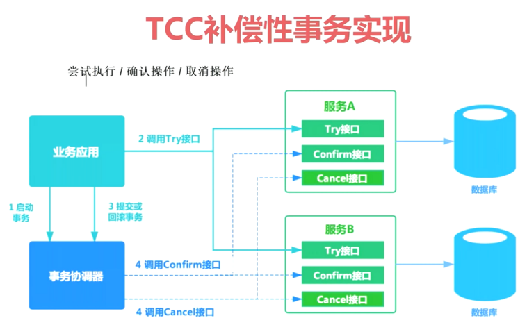
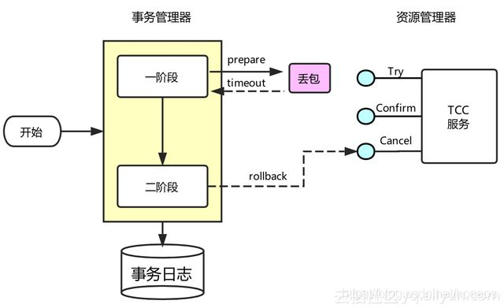
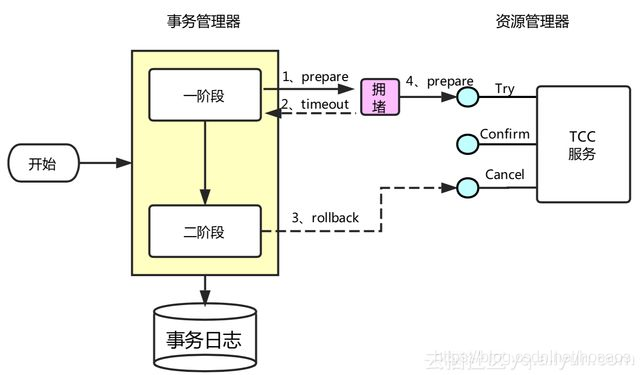
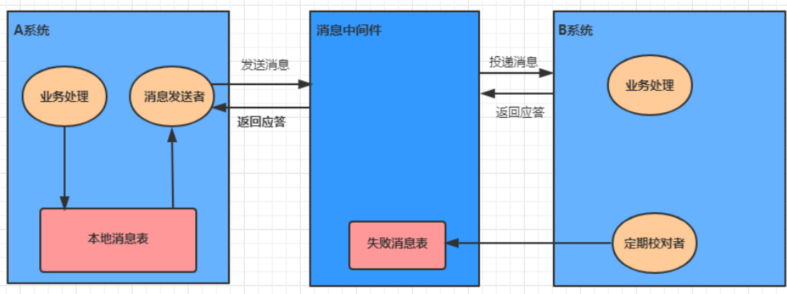
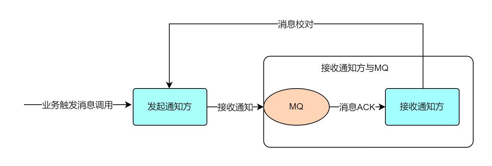
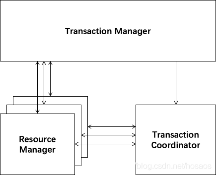
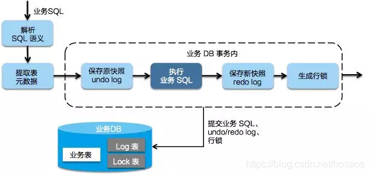
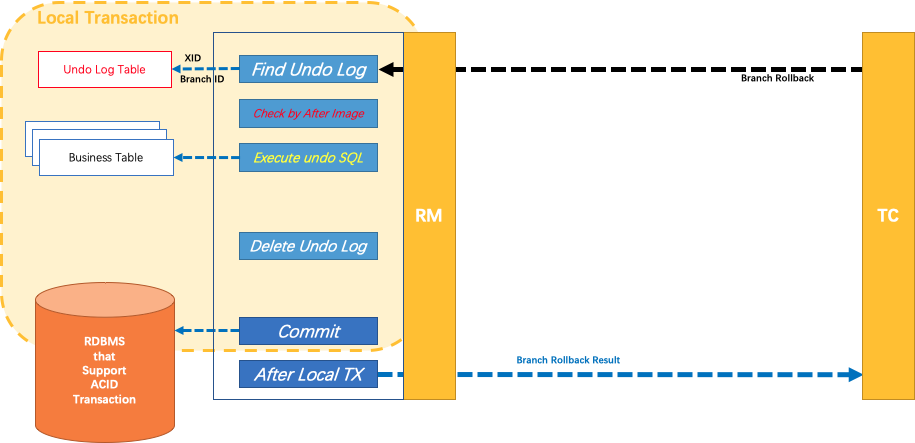
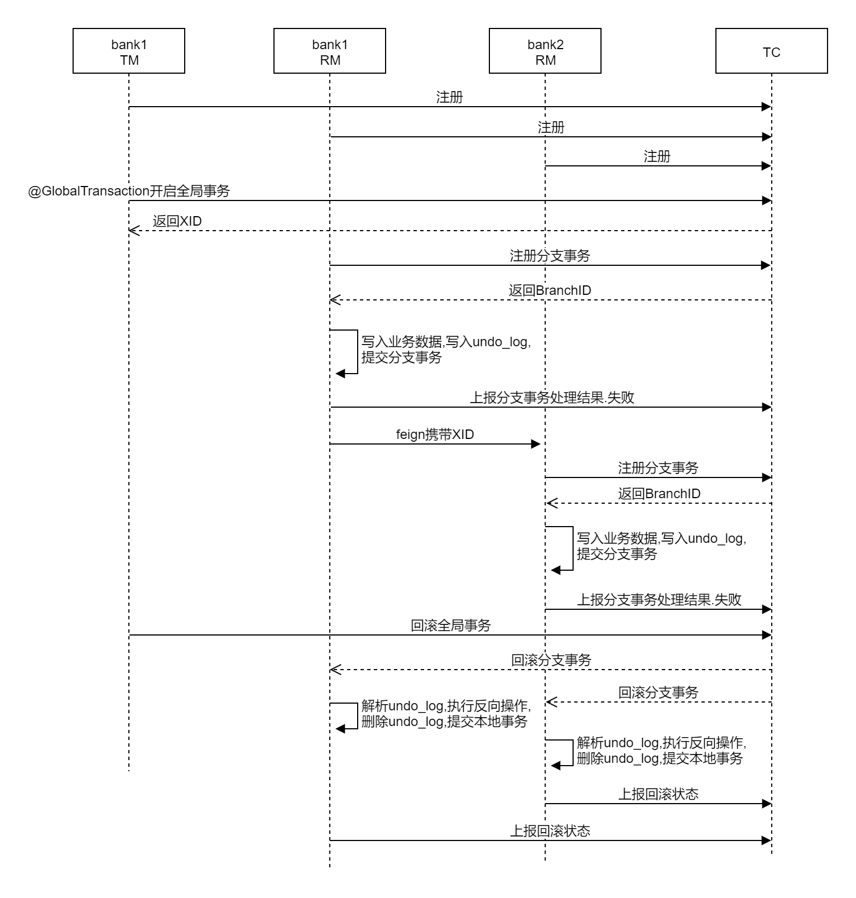

# Transaction


# 分布式事务

* 单个程序访问不同的数据库或多个服务之间相互调用产生的事务一致性问题
* 若某个系统内部出现跨多个库的操作,是不合规的,应该每个服务只操作自己对应的数据库
* 若需要操作别的服务对应的库,不允许直连别的服务的库,违反微服务架构的规范
* 若随意交叉访问,服务是没法管理的,数据可能经常被别人改错,自己的库被别人写挂
* 若要操作其他服务的库,必须通过调用该服务的接口来实现,绝对不允许交叉访问别人的数据


# CAP

* CAP是Consistency,Availability,Partition tolerance的缩写,分别表示一致性,可用性,分区容忍性


## Consistency

* 一致性是指写操作后的读操作可以读取到最新的数据状态,当数据分布在多个节点上,从任意结点读取到的数据都是最新的状态
* 如何实现一致性:
  * 写入主数据库后要将数据同步到从数据库
  * 写入主数据库后,在向从数据库同步期间要将从数据库锁定,待同步完成后再释放锁,以免在新数据写入成功后,向从数据库查询到旧的数据
* 分布式系统一致性的特点:
  * 由于存在数据同步的过程,写操作的响应会有一定的延迟
  * 为了保证数据一致性会对资源暂时锁定,待数据同步完成释放锁定资源
  * 如果请求数据同步失败的结点则会返回错误信息,一定不会返回旧数据


## Availability

* 可用性是指任何事务操作都可以得到响应结果,且不会出现响应超时或响应错误
* 如何实现可用性:
  * 写入主数据库后要将数据同步到从数据库
  * 由于要保证从数据库的可用性,不可将从数据库中的资源进行锁定
  * 即时数据还没有同步过来,从数据库也要返回要查询的数据,哪怕是旧数据,如果连旧数据也没有则可以按照约定返回一个默认信息,但不能返回错误或响应超时
* 分布式系统可用性的特点:
  * 所有请求都有响应,且不会出现响应超时或响应错误


## Partition tolerance

* 通常分布式系统的各各结点部署在不同的子网,这就是网络分区,不可避免的会出现由于网络问题而导致结点之间通信失败,此时仍可对外提供服务,这叫分区容忍性
* 如何实现分区容忍性:
  * 尽量使用异步取代同步操作,例如使用异步方式将数据从主数据库同步到从数据,这样结点之间能有效的实现松耦
  * 添加从数据库结点,其中一个从结点挂掉其它从结点提供服务
* 分布式分区容忍性的特点:
  * 分区容忍性分是布式系统具备的基本能力


# BASE


## 强一致性和最终一致性

* CAP理论说明一个分布式系统最多只能同时满足一致性,可用性和分区容忍性中的两项
* AP在实际应用中较多,AP即舍弃一致性,保证可用性和分区容忍性,但是在实际生产中很多场景都要实现一致性,即使不要一致性,但是最终也要将数据同步成功来保证数据一致.这种一致性和CAP的一致性不同,CAP中的一致性要求在任何时间查询每个结点数据都必须一致,是强一致性,但是最终一致性允许在一段时间内每个结点的数据不一致,但是经过一段时间每个结点的数据必须一致,强调的是最终数据的一致性
* BASE 是 Basically Available(基本可用),Soft state(软状态)和 Eventually consistent(最终一致性)的缩
  写.BASE理论是对CAP中AP的一个扩展,通过牺牲强一致性来获得可用性,当出现故障允许部分不可用但要保证核心功能可用,允许数据在一段时间内是不一致的,但最终达到一致状态.满足BASE理论的事务称之柔
  性事务


## 基本可用

* 分布式系统在出现故障时,允许损失部分可用功能,保证核心功能可用.如,电商网站交易付款出现问题了,商品依然可以正常浏览


## 软状态

* 由于不要求强一致性,所以BASE允许系统中存在中间状态(也叫软状态),这个状态不影响系统可用性,如订单的支付中,数据同步中等状态,待数据最终一致后状态改为成功状态


## 最终一致

* 最终一致是指经过一段时间后,所有节点数据都将会达到一致.如订单的支付中状态,最终会变为支付成功或者支付失败,使订单状态与实际交易结果达成一致,但需要一定时间的延迟,等待


# 分布式唯一ID


## 概述

* 全局唯一性,不可出现重复id数据
* 需要防止恶意用户根据id规则来获取数据
* 保证下一个id一定大于上一个id


## UUID

* 优点:代码实现简单,不占用宽带,数据迁移不受影响
* 缺点:无序,无法保证递增趋势,字符存储,传输以及查询慢,不可读


## SnowFlake

* 雪花算法,实现方式是用64位的二进制分别表示不同的含义:
  * 从左到右的第1位为0,固定
  * 第2位到42位,总共41位,表示二进制的毫秒时间戳
  * 第43位到47位,总共5位,表示二进制的机房编号
  * 第48位到52位,总共5位,表示二进制的机器编号
  * 第53位到64位,总共12位,表示二进制的数据编号,顺序生成
* 优点:代码实现简单,不占用宽带,数据迁移不受影响,低位趋势递增
* 缺点:强依赖时钟(多台服务器时间一定要一样),无序无法保证趋势递增


## Redis

* 集群缩减版本:年份+当前这天属于这一年的第多少天+小时+redis自增:2+3+2+6=13位.调用intr方法

* 优点:不依赖数据,灵活方便,性能优于数据库自增长,没有单点故障
* 缺点:需要占用网络资源,性能要比本地生成慢,需要增加redis集群


## Zookeeper

* 集群环境下生成方式同Redis,调用的是InterProcessMutex方法
* 优缺点同Redis差不多


# 分布式锁


## Redis

* nx方法,若key存在则返回nil,若key不存在则设置值
* 需要使用到特定的脚本才行,详见官网的set方法


## Redisson

* Redis封装的专门用于分布式的各种锁,信号量等机制的框架


## Zookeeper

* 临时节点的新增删除,集群中同一时间只能有一个节点进行新增


# 2PC-两阶段提交


## 核心

* 事务管理器(TM),管理器负责协调多个数据库的事务
* 准备阶段(Prepare phase):TM给每个参与者发送Prepare消息,每个数据库参与者在本地执行事务,并写本地的Undo/Redo日志,此时事务没有提交
* 提交阶段(Commit phase):如果TM收到了参与者的执行失败或者超时消息时,直接给每个参与者发送回滚消息;否则,发送提交(Commit)消息.参与者根据TM的指令执行提交或者回滚操作,并释放事务处理过程中使用的锁资源
* 必须在最后阶段释放锁资源


## 缺陷

* 单点故障:TM出错,网络问题,事务提交可能会失败
* 如果第二阶段的TM挂了,那么事务A,B就不知道该如何处理事务了
* 如果A事务收到了TM的消息,执行了事务,但是B没收到,此时B事务该如何处理,事务不一致
* 阻塞资源:占用数据库连接.如果网络出现问题,会一直占用数据库连接,性能低
* 数据不一致:二阶段回滚出错或部分事务没有收到TM发送的消息,会造成数据不一致
* 因为严重依赖于数据库层面来搞定复杂的事务,效率很低,不适合高并发的场景


## 适用

* 比较适合单块应用里,跨多个库的分布式事务
* 基于Spring + JTA的组合可以实现该事务


# 3PC-三阶段提交


* 三阶段提交比二阶段提交多了个准备提交阶段,会将一阶段的结果告诉各个事务.如果三阶段TM挂了,仍然可以根据二阶段的结果做相应的事务操作


# XA


 * Transaction Manager(TM):事务管理器,控制全局事务的边界,负责开启一个全局事务,并最终发起全局提交或全局回滚的决议
 * Resource Manager(RM):资源管理器,事务的参与者,一般情况下是指一个数据库实例,通过资源管理器对该数据库进行控制,资源管理器控制着分支事务
* 内部XA:单机情况下, 由binlog充当TM的角色.一个事务过来,写入redo.log和undo.log.事务提交时,同时写入redo.log和bin.log,保证redo.log和bin.log一致,如果事务撤销,则根据undo.log进行撤销
* 外部XA:分布式集群的情况下,一般加代理层来充当TM的角色,实现对事务的支持


# TCC

 

* TCC的全称是:Try->Confirm->Cancel
  * Try:对各个服务的资源做检测,对资源进行锁定或者预留
  * Confirm:在各个服务中执行实际的操作,即使用Try阶段资源
  * Cancel:若任何一个服务出错,就进行补偿,将已经执行成功的业务逻辑回滚,释放Try预留的资源
* 例如跨银行银行转账,若用TCC方案解决如下
  * Try:先把两个银行账户中的资金给它冻结住就不让操作了
  * Confirm:执行实际的转账操作,A银行账户的资金扣减,B银行账户的资金增加
  * Cancel:若任何一个银行的操作失败,就需要回滚进行补偿.比如A银行账户如果已经扣减了,但是B银行账户资金增加失败了,那么就得把A银行账户资金给加回去
* 这种方案几乎很少使用,因为这个事务回滚严重依赖于自己写代码来回滚和补偿,会造成补偿代码巨大
* 一般来说跟钱,交易相关的场景可以用TCC,严格保证分布式事务,要么全部成功,要么全部自动回滚


## 幂等控制

* 使用TCC时要进行幂等控制,网络或重试都有可能导致这几个操作的重复执行

* TCC需要在的二阶段Try,Confirm和Cancel接口保证幂等,这样不会重复使用或者释放资源

* 如银行转账

  * A向B转账1000,在confirm()中,A余额-1000,冻结余额-1000,这一步是实现幂等性的关键
  * 在操作资金账户时,为了防止并发情况下数据不一致的出现,肯定会避免出现这种代码

  ```java
  //根据userId查到账户
  Account account = accountMapper.selectById(userId);
  //取出当前资金
  int availableMoney = account.getAvailableMoney();
  account.setAvailableMoney(availableMoney-1000);
  //更新剩余资金
  accountMapper.update(account);
  ```

  * 上述操作本质上是一个读-改-写的过程,不是原子的,在并发情况下会出现数据不一致问题
  * 所以最简单的做法是直接update

  ```sql
  update account set available_money = available_money-1000 where user_id=#{userId}
  ```

  * 这利用了数据库行锁特性解决了并发下的数据不一致问题,但是TCC中,单纯使用这个方法不行
  * 该方法能解决并发单次操作下的扣减余额问题,但是不能解决多次操作带来的多次扣减问题,假设执行了两次,按这种方案,用户账户就少了2000块
  
  

### 解决方案

* 解决思路在上述分支事务记录中增加执行状态,每次执行前都查询该状态  

* 可以引入转账订单状态来做判断,若订单状态为已支付,则直接return
* 新建一张去重表,用订单id做唯一键,若插入报错返回也可以


## 空回滚

* 事务协调器在调用TCC服务的一阶段Try操作时,可能会出现因为丢包而导致的网络超时,此时事务协调器会触发二阶段回滚,调用TCC服务的Cancel操作
* TCC服务在未收到Try请求的情况下收到Cancel请求,这种场景被称为空回滚
* TCC服务在实现Cancel时应当允许空回滚的执行




### 解决方案

* 第一种:如果try()没执行,那么订单一定没创建,所以cancle()里可以加一个判断,如果上下文中订单编号orderNo不存在或者订单不存在,直接返回成功
* 该方案的核心思想就是回滚请求处理时,如果对应的具体业务数据为空,则返回成功

* 第二种:通过中间件或数据库来实现
* TM在发起全局事务时生成全局事务记录,全局事务ID贯穿整个分布式事务调用链条.再额外增加一张分支事务记录表,其中有全局事务ID和分支事务ID.第一阶段 Try 方法里会插入一条记录,表示一阶段执行了.Cancel 接口里读取该记录,如果该记录存在,则正常回滚;如果该记录不存在,则是空回滚  


## 防悬挂



* 事务协调器在调用TCC服务的一阶段Try操作时,可能会因网络而导致超时,此时事务协调器会触发二阶段回滚,调用Cancel操作.在此之后,拥堵在网络上的一阶段Try数据包被TCC服务收到,出现了二阶段Cancel请求比一阶段Try请求先执行的情况
* 用户在实现TCC服务时,应当允许空回滚,但是要拒绝执行空回滚之后到来的一阶段Try请求


### 解决方案

* 可以在二阶段执行时插入一条事务控制记录,状态为已回滚,这样当一阶段执行时,先读取该记录,如果记录存在,就认为二阶段回滚操作已经执行,不再执行try方法


## Tcc-transaction

* [github](https://github.com/changmingxie/tcc-transaction)地址
* 和Seata类似,需要部署一个独立的服务才能运行


## Hmily

* [github](https://github.com/dromara/hmily)
* 不需要独立部署
* 支持嵌套事务
* 采用disruptor框架进行事务日志的异步读写,与RPC框架的性能毫无差别
* 支持SpringBoot-starter 项目启动,使用简单
* RPC框架支持:dubbo,motan,springcloud
* 本地事务存储支持:redis,mongodb,zookeeper,file,mysql
* 事务日志序列化支持:java,hessian,kryo,protostuff
* 采用Aspect AOP切面思想与Spring无缝集成,天然支持集群
* RPC事务恢复,超时异常恢复等


### 原理

* Hmily利用AOP对参与分布式事务的本地方法与远程方法进行拦截处理,通过多方拦截,事务参与者能透明的调用到另一方的Try,Confirm,Cancel方法,传递事务上下文,并记录事务日志,酌情进行补偿,重试等
* Hmily不需要事务协调服务,但需要提供一个数据库(mysql/mongodb/zookeeper/redis/file)来进行日志存储
* Hmily实现TCC服务与普通的服务一样,只需要暴露一个接口,也就是Try,Confirm/Cancel业务逻辑,只是因为全局事务提交/回滚的需要才提供的,因此Confirm/Cancel业务只需要被Hmily TCC事务框架发现即可,不需要被调用它的其他业务服务所感知


# 本地消息表


* 消息队列+本地事件表+定时任务

* A系统在自己本地一个事务里操作,同时插入一条数据到消息表,接着A系统将这个消息发送到MQ中去
* B系统接收到消息之后,在一个事务里,往自己本地消息表里插入一条数据,同时执行其他的业务操作,如果这个消息已经被处理过了,那么此时这个事务会回滚,这样保证不会重复处理消息
* B系统执行成功之后,就会更新自己本地消息表的状态以及A系统消息表的状态
* 如果B系统处理失败了,那么就不会更新消息表状态,那么此时A系统会定时扫描自己的消息表,如果有没处理的消息,会再次发送到MQ中去,让B再次处理
* 这个方案保证了最终一致性,哪怕B事务失败了,但是A会不断重发消息,直到B成功为止
* 这个方案最大的问题就在于严重依赖于数据库的消息表来管理事务.完全无法胜任高并发场景,也不好扩展


# MQ消息最终一致性

 

* 这里的MQ专指RocketMQ,不用本地的消息表,直接基于RocketMQ来实现事务
* Producer发送事务消息至MQ Server,MQ Server将消息状态标记为Prepared,此时这条消息消费者是无法消费到的,如果这个prepared消息发送失败那么就直接取消操作不执行了
* MQ Server接收到Producer发送给的消息则回应发送成功表示MQ已接收到消息
* Producer执行业务代码逻辑,通过本地数据库事务控制
  * 若Producer本地事务执行成功则自动向MQServer发送commit消息,MQ Server接收到commit消息后将状态标记为可消费,此时MQ订阅方即正常消费消息
  * 若Producer 本地事务执行失败则自动向MQServer发送rollback消息,MQ Server接收到rollback消息后将删除消息
* MQ订阅方消费消息,消费成功则向MQ回应ack,否则将重复接收消息.这里ack默认自动回应,即程序执行正常则自动回应ack
* 事务回查:如果执行Producer端本地事务过程中,执行端挂掉或超时,MQ Server将会不停的询问同组的其他 Producer来获取事务执行状态
* MQ Server会根据事务回查结果来决定是否投递消息
* 该方案里,B服务的事务失败的解决方案:
  * 重试,自动不断重试直到成功,最好设置重试次数,尽量不影响业务的正常运行
  * 实在无法成功,事务回滚.比如B系统本地回滚后,通知系统A也回滚;或者发送报警手工回滚和补偿
* 对于事务不是特别严谨的场景比较合适,但是会存在资源浪费


## 独立消息服务


* 消息服务子系统
* 消息管理子系统
* 消息状态确认子系统
* 消息恢复子系统
* 实时消息服务


# MQ最大努力通知



* 系统A本地事务执行完之后,发送消息到MQ
* 这里会有个专门消费MQ的最大努力通知服务,该服务会消费MQ然后写入数据库中记录下来,或者是放入个内存队列,接着调用系统B的接口
* 若系统B执行成功就事务完成.若系统B执行失败了,那么最大努力通知服务就定时尝试重新调用系统B,反复N次,最后还是不行就放弃,同时通知A服务进行回滚
* 该方式和可靠消息最终一致性类似
* 如果尽最大努力也没有通知到接收方,或者接收方消费消息后要再次消费,此时可由接收方主动向通知方查询消息信息来满足需求


## 方案一



* 利用MQ的ack机制由MQ向接收通知方发送通知,流程如下
* 发起通知方将通知发给MQ
* 使用普通消息机制将通知发给MQ
* 如果消息没有发出去可由接收通知方主动请求发起通知方查询业务执行结果
* 接收通知方监听 MQ
* 接收通知方接收消息,业务处理完成回应ack
* 接收通知方若没有回应ack则MQ会重复通知
* MQ会按照间隔1min,5min,10min,30min,1h,2h,5h,10h的方式,逐步拉大通知间隔,直到达到通知要求的时间窗口上限
* 接收通知方可通过消息校对接口来校对消息的一致性


## 方案二


* 利用MQ的ack机制,与上面不同的是应用程序向接收通知方发送通知
  * 发起通知方将通知发给MQ.使用可靠消息一致方案中的事务消息保证本地事务与消息的原子性,最终将通知先发给MQ
  * 通知程序监听 MQ,接收MQ的消息.上面的方案接收通知方直接监听MQ,本方案由通知程序监听MQ.通知程序若没有回应ack则MQ会重复通知
  * 通知程序通过互联网接口协议调用接收通知方案接口,完成通知.通知程序调用接收通知方案接口成功就表示通知成功,即消费MQ消息成功,MQ将不再向通知程序投递通知消息
  * 接收通知方可通过消息校对接口来校对消息的一致性


## 区别

* 方案1中接收通知方与MQ接口,即接收通知方案监听 MQ,此方案主要应用与内部应用之间的通知
* 方案2中由通知程序与MQ接口,通知程序监听MQ,收到MQ的消息后由通知程序通过互联网接口协议调用接收通知方.此方案主要应用于外部应用之间的通知,例如支付宝,微信的支付结果通知


# Seata


阿里的分布式事务框架,支持AT,XA,TCC等,详见官网


## 安装

* 每一个微服务必须创建undo.log,安装事务协调器:seate-server
 * 导入依赖,解压并启动seata-server
 * registry.conf:注册中心配置,修改registry:nacos
 * 所有想要用到分布式事务的微服务使用seata DataSourceProxy代理自己的数据源
 * 每个微服务都必须导入registry.conf,file.conf,vgroup_mapping.{application.name}-fescar-server-group="default"
 * 启动:seata-server.sh -p 8090 -m file


## 事务流程


* TM向TC申请开启一个全局事务,TC创建全局事务后返回全局唯一XID,XID会在全局事务上下文传播
* RM向TC注册分支事务,该分支事务归属于拥有相同XID的全局事务
* 各个RM执行相应的分支事务
* TM向TC发起全局提交或回滚
* TC调度XID下的分支事务完成提交或回滚


## AT


### 概述



 * AT模式是基于XA事务演进而来的一个分布式事务中间件,XA是一个基于数据库实现的分布式事务协议,本质上和两阶段提交一样,需要数据库支持,Mysql5.6以上版本支持XA协议
 * 一种无侵入的分布式事务解决方案,2PC的广义实现
 * 编程模型不变,轻依赖不需要为分布式事务场景做特定设计
 * 一阶段提交,不阻塞,连接释放,保证整个系统的吞吐
 * Transaction Coordinator(TC):事务协调器,它是独立的中间件,需要独立部署运行,它维护全局事务的运行状态,接收TM指令发起全局事务的提交与回滚,负责与RM通信协调各各分支事务的提交或回滚
 * Transaction Manager(TM):事务管理器,TM需要嵌入应用程序中工作,负责开启一个全局事务,并最终向TC发起全局提交或全局回滚的指令
 * Resource Manager(RM):控制分支事务,负责分支注册,状态汇报,并接收事务协调器的指令,驱动分支(本地)事务的提交和回滚
 * Seata有一个重要的机制:**回滚日志**
    * 每个分支事务对应的数据库中都需要有一个回滚日志表 UNDO_LOG,在真正修改数据库记录之前,都会先记录修改前的记录值,以便之后回滚
    * 在收到回滚请求后,会根据 UNDO_LOG 生成回滚操作的 SQL 语句来执行
    * 如果收到的是提交请求,就把 UNDO_LOG 中的相应记录删除掉
 * RM是通过**监控拦截JDBC**实现自动和 TC 交互的.例如监控到开启本地事务了,就会自动向TC注册、生成回滚日志、向TC汇报执行结果
 * 如果二阶段回滚失败,例如有某个微服务挂掉了,那么所有正常的微服务也都不会执行回滚,当这个微服务重新正常运行后,TC 会重新执行全局回滚


### 事务流程


* 每个RM使用DataSourceProxy连接数据库,其目的是使用ConnectionProxy,使用数据源和数据连接代理的目的就是在第一阶段将undo_log日志和业务数据放在一个本地事务提交,这样就保证了只要有业务操作就一定有undo_log
* 在第一阶段undo_log中存放了数据修改前和修改后的值,为事务回滚作好准备,所以第一阶段完成就已经将分支事务提交,也就释放了锁资源
* TM开启全局事务开始,将XID全局事务id放在事务上下文中,通过feign调用也将XID传入下游分支事务,每个分支事务将自己的Branch ID分支事务ID与XID关联
* 第二阶段全局事务提交,TC会通知各各分支参与者提交分支事务,在第一阶段就已经提交了分支事务,这里各各参与者只需要删除undo_log即可,并且可以异步执行,第二阶段很快可以完成
* 第二阶段全局事务回滚,TC会通知各各分支参与者回滚分支事务,通过 XID 和 Branch ID 找到相应的回滚日志,通过回滚日志生成反向的 SQL 并执行,以完成分支事务回滚到之前的状态,如果回滚失败则会重试回滚操作


### 第一阶段

* Seata的JDBC数据源代理通过对业务SQL的解析,把业务数据在更新前后的数据镜像组织成回滚日志,利用本地事务的ACID 特性,将业务数据的更新和回滚日志写入在同一个本地事务中提交.这样可以保证任何提交的业务数据的更新一定有相应的回滚日志存在
* 提交完成之后将生成后镜像,即更新后的数据保存为快照,用于事务的幂等,隔离等



* 基于这样的机制,分支的本地事务便可以在全局事务的第一阶段提交,并马上释放本地事务锁定的资源,并且不占用数据库连接
* 这也是Seata和XA事务的不同之处,两阶段提交往往对资源的锁定需要持续到第二阶段实际的提交或者回滚,而有了回滚日志之后,可以在第一阶段释放对资源的锁定,降低了锁范围,提高效率,即使第二阶段发生异常需要回滚,只需找对undo.log中对应数据并反解析成sql来达到回滚目的
* 同时Seata通过代理数据源将业务sql的执行解析成undo.log来与业务数据的更新同时入库,达到了对业务无侵入的效果


### 第二阶段

* 如果决议是全局提交,此时分支事务在第一阶段已经完成提交,不需要特殊处理,只需要异步清理回滚日志即可,二阶段可以非常快速地完成


* 如果决议是全局回滚,RM收到协调器发来的回滚请求,通过XID和Branch ID找到相应的回滚日志记录,**通过回滚记录生成反向的更新SQL并执行**,以完成分支的回滚




### 提交成功


### 回滚



* 因为一阶段已经提交数据,如果二阶段发生异常需要回滚,此时可能发生事务问题
* 先需要用一阶段生成的新镜像和回滚时数据库的数据进行比对,如果数据一致,则进行回滚.如果数据不一致,需要根据实际情况进行更新操作


### SpringCloud


* 在SpringCloud的编程中,需要给分布式事务发起的入口标注@GlobalTransactional,每一个远程的小事务仍然适用@Transactional
* GlobalTransactionalInterceptor会拦截@GlobalTransactional注解的方法,生成XID,XID会在整个分布式事务中传递  
* 在程序中,业务接口(Business)需要通过注解来标识他是一个全局事务,此时该接口就是TM
* Business会请求 TC,说明自己要开启一个全局事务,TC 会生成一个全局事务ID(XID),并返回给业务接口
* 业务接口得到XID 后,开始调用微服务Storage
* Storage收到 XID,知道自己的事务属于这个全局事务,Storage 执行自己的业务逻辑,操作本地数据库
* Storage会把自己的事务注册到 TC,作为这个XID下面的一个**分支事务**,并且把自己的事务执行结果也告诉 TC.此时Storage的角色是RM(资源管理者),资源是指本地数据库
* Order、Account的执行逻辑与 Storage 一致
* 在各个微服务都执行完成后,TC可以知道XID下各个分支事务的执行结果,Business也就知道了
* Business如果发现各个微服务的本地事务都执行成功了,就请求 TC 对这个 XID 提交,否则回滚
* TC 收到请求后,向 XID 下的所有分支事务发起相应请求
* 各个微服务收到 TC 的请求后,执行相应指令,并把执行结果上报 TC


## TCC


* `@LocalTCC`:TCC事务注解,必须写在接口上
* `@TwoPhaseBusinessAction`:TCC服务参与者注解,配置在接口方法上,必须在`@LocalTCC`修饰的接口中使用
  * `name`:指定被调用的微服务名称
  * `commitMethod`:指定事务成功时的提交方法
  * `rollbackMethod`:指定事务失败时的回滚方法
* 其他同AT模式,也需要在具体的调用方法上加`@GlobalTransactional`和`@Trabsactional`


# 对比


## 2PC

* 最大的诟病是一个阻塞协议.RM在执行分支事务后需要等待TM的决定,此时服务会阻塞并锁定资源.由于其阻塞机制和最差时间复杂度高, 因此,这种设计不能适应随着事务涉及的服务数量增加而扩展的需要,很难用于并发较高以及子事务生命周期较长 (long-running transactions) 的分布式服务中


## TCC

* 如果拿TCC事务的处理流程与2PC两阶段提交做比较,2PC通常都是在跨库的DB层面,而TCC则在应用层面的处理,需要通过业务逻辑来实现
* 这种分布式事务的实现方式的优势在于,可以让应用自己定义数据操作的粒度,使得降低锁冲突、提高吞吐量成为可能.不足之处则在于对应用的侵入性非常强,业务逻辑的每个分支都需要实现try,confirm,cancel三个操作.此外,其实现难度也比较大,需要按照网络状态、系统故障等不同的失败原因实现不同的回滚策略.典型的使用场景：满,登录送优惠券等


## 可靠消息最终一致性

* 事务适合执行周期长且实时性要求不高的场景.引入消息机制后,同步的事务操作变为基于消息执行的异步操作, 避免了分布式事务中的同步阻塞操作的影响,并实现了两个服务的解耦.典型的使用场景:注册送积分,登录送优惠券等


## 最大努力通知

* 是分布式事务中要求最低的一种,适用于一些最终一致性时间敏感度低的业务；允许发起通知方处理业务失败,在接收通知方收到通知后积极进行失败处理,无论发起通知方如何处理结果都会不影响到接收通知方的后续处理;发起通知方需提供查询执行情况接口,用于接收通知方校对结果.典型的使用场景:银行通知、支付结果通知等
